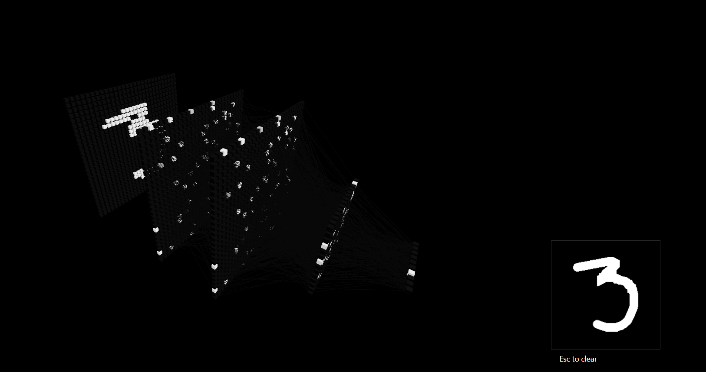

# Visualize NN

Visualize neural network on user's inputs

- React Three Fiber for scene render
- Tensorflow.js for model training and inference

Inspired by [Visualization of a fully connected neural network](https://youtu.be/Tsvxx-GGlTg) and [okdalto/VisualizeMNIST](https://github.com/okdalto/VisualizeMNIST)
